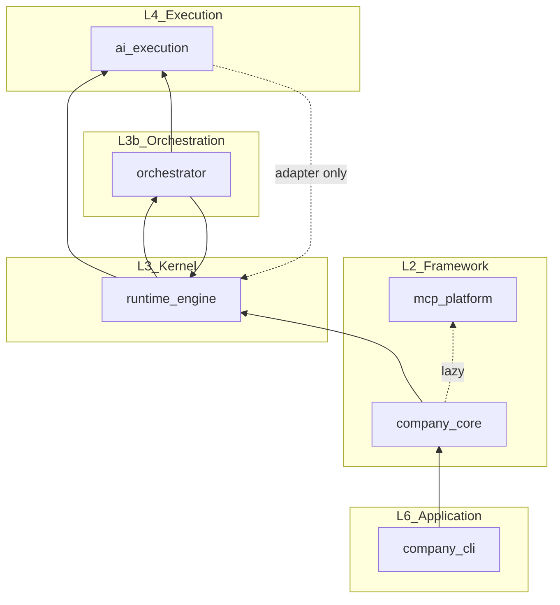

# EngineeringOS Dependency Analysis

**Date:** 2026-07-02  
**Reference:** `docs/framework/dependency-map.md`, `docs/framework/package-architecture.md`, `runtime/interfaces.md` §3

---

## Intended Dependency Hierarchy

```
CLI (company_cli)
  ↓
Framework API (company_core)
  ↓
Runtime (runtime_engine)
  ↓
Orchestrator (orchestrator)
  ↓
AI Execution Platform (ai_execution)
  ↓
Providers (cursor, scaffold, placeholders)
```

**Cross-cutting (should not create upward violations):**
- `mcp_platform` — L2 platform service, consumed by Framework API
- L1 content: `workflow.yaml`, `handbook/`, `.cursor/agents/`

---

## Actual Dependency Graph (Production Code)



**Solid arrows:** direct imports  
**Dotted:** lazy imports or adapter-boundary imports only

---

## Cross-Package Import Inventory

### `company_cli` → downstream

| Target | Files | Compliant? |
|--------|-------|:----------:|
| `company_core` | `context.py`, all commands | ✓ |
| `runtime_engine` | — | ✓ (none) |
| `orchestrator` | — | ✓ (none) |
| `ai_execution` | — | ✓ (none) |

**Minor leak:** `commands/project.py` imports `ProjectCreateRequest` from `company_core.api.project` instead of `company_core.models` — still within Framework API package.

### `company_core` → downstream

| Target | Files | Compliant? |
|--------|-------|:----------:|
| `runtime_engine` | `api/project.py` | **✗ Forbidden** |
| `mcp_platform` | `api/mcp.py`, `api/company.py` (lazy) | ✓ (documented optional) |

### `runtime_engine` → downstream

| Target | Files | Compliant? |
|--------|-------|:----------:|
| `orchestrator` | `factory.py`, `lifecycle.py` | ✓ (new layer — **undocumented**) |
| `ai_execution` | `factory.py` | ✓ (new layer — **undocumented**) |
| `company_core` | — | ✓ (none) |
| Provider SDKs | — | ✓ (none) |

### `orchestrator` → downstream

| Target | Files | Compliant? |
|--------|-------|:----------:|
| `runtime_engine.types` | `phase_executor.py`, `pipeline_executor.py` | **✗ Layer inversion** |
| `runtime_engine.errors` | `pipeline_executor.py` | **✗ Layer inversion** |
| `ai_execution` | — | ✓ (uses `IAgentAdapter` Protocol only) |

### `ai_execution` → downstream

| Target | Files | Compliant? |
|--------|-------|:----------:|
| `runtime_engine.types` | `adapter/runtime_adapter.py` (lazy) | **△ Adapter boundary** — intentional anti-corruption |
| `orchestrator` | — | ✓ (none) |

### `mcp_platform` → downstream

| Target | Compliant? |
|--------|:----------:|
| Any EngineeringOS package | ✓ (none — clean leaf) |

---

## Dependency Inversions and Shortcuts

| ID | From | To | Type | Severity |
|----|------|-----|------|----------|
| D1 | `company_core` | `runtime_engine` | Framework API constructs Runtime directly | **Critical** |
| D2 | `orchestrator` | `runtime_engine.types` | Lower layer imports upper kernel dataclasses | **High** |
| D3 | `orchestrator` | `runtime_engine.errors` | Shared error types via wrong package | **High** |
| D4 | `runtime_engine.lifecycle` | `orchestrator.approval_hooks` via `runtime._orchestrator` | Runtime reads Orchestrator internal state | **Medium** |
| D5 | `company_core.api.project` | `runtime._store` | Private API access | **Medium** |
| D6 | `ai_execution.factory` | `registry._config` (`SLF001`) | Encapsulation break | **Low** |

---

## Declared vs Actual Package Metadata

| Package | Standalone `pyproject.toml` | Declared inter-package deps | Actual runtime deps |
|---------|----------------------------|----------------------------|---------------------|
| Root `ai-company` | Yes | None between packages | All six co-installed |
| `company_core` | Yes | `pyyaml` only | `runtime_engine`, `mcp_platform` |
| `company_cli` | Yes | `company-core` | `company_core` only |
| `runtime_engine` | No | — | `orchestrator`, `ai_execution` |
| `orchestrator` | No | — | `runtime_engine` (types) |
| `ai_execution` | No | — | `runtime_engine` (adapter) |
| `mcp_platform` | No | — | None |

**Risk:** Standalone `pip install company-core` succeeds but `ProjectAPI` fails at import or runtime.

---

## Circular Dependency Analysis

| Cycle | Present? | Notes |
|-------|:--------:|-------|
| `runtime_engine` ↔ `orchestrator` | **Soft** | RT imports ORCH at factory; ORCH imports RT types at execution — no import-time cycle due to lazy imports in phase_executor |
| `runtime_engine` ↔ `ai_execution` | **Soft** | RT factory creates adapter; adapter imports RT types at invoke time |
| `company_core` ↔ `runtime_engine` | **No cycle** | One-directional |

**Module load:** No hard circular import detected. **Architectural cycle:** Runtime and Orchestrator are mutually dependent at the domain level.

---

## Forbidden Dependency Checklist

| Rule (from `dependency-map.md`) | Status |
|----------------------------------|--------|
| `runtime_engine` must not import cursor, vscode, openai, anthropic | **Pass** |
| `company_core` must not import `runtime_engine` | **Fail** (`api/project.py`) |
| `mcp_platform` must not import `runtime_engine` | **Pass** |
| `employees/` content must not import code | **Pass** (markdown only) |
| `handbook/` must not import code | **Pass** |
| L0–L3 never import L4–L7 | **Partial** — orchestrator imports runtime types (L3→L3 inversion) |

---

## Recommended Dependency Target State (Documentation Only)

No redesign — alignment with **already-approved** three-layer execution model:

```
company_cli → company_core (manifest, models, MCP facade)
company_cli composition root → create_runtime()  [move from ProjectAPI]

runtime_engine → orchestrator, ai_execution (factory only)
orchestrator → kernel_contracts (shared types)  [extract from runtime_engine.types]
orchestrator → IAgentAdapter (protocol from kernel_contracts or ai_execution)
ai_execution → kernel_contracts (adapter result types only)
mcp_platform → (no upstream packages)
```

---

## Dependency Health Score

| Metric | Score |
|--------|:-----:|
| CLI isolation | 9/10 |
| Provider isolation | 9/10 |
| Framework API purity | 5/10 |
| Orchestrator/Runtime separation | 6/10 |
| Metadata honesty (pyproject) | 4/10 |
| **Overall dependency health** | **6.6/10** |
