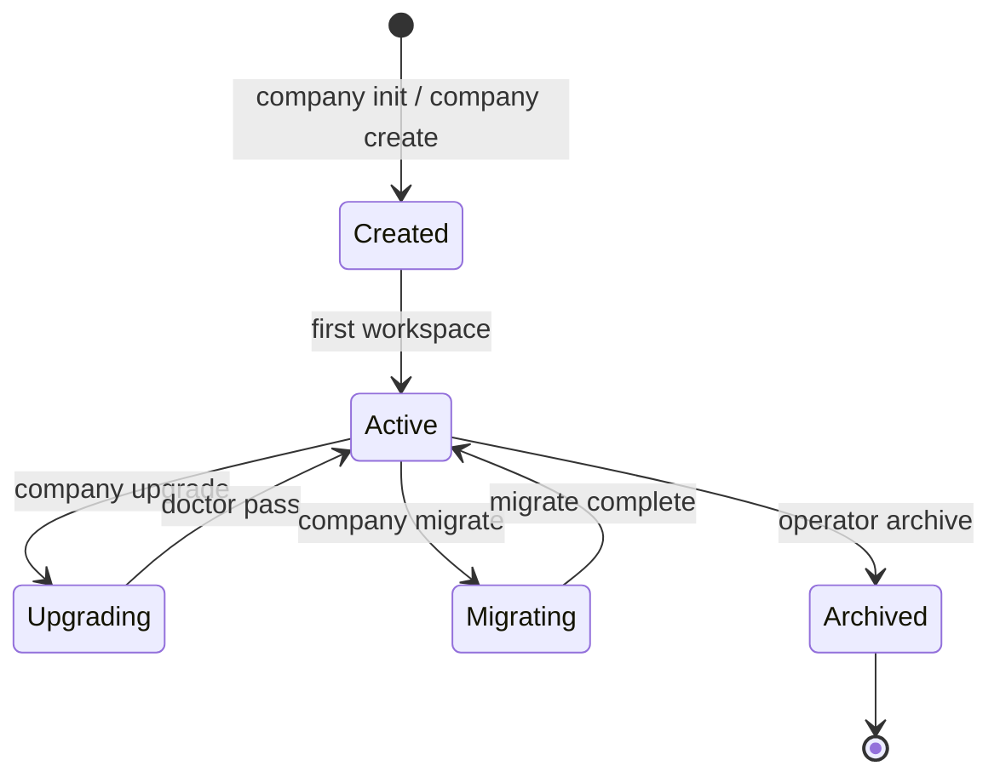

# Company Instance Model — AI Company Framework

**Version:** 2.0.0  
**Date:** 2026-07-01  
**Parent:** [framework-architecture.md](./framework-architecture.md)

---

## Definition

A **Company Instance** is **one configured deployment** of the AI Company Framework. It is the operational "company" that owns employees, policies, workspaces, and projects.

| | Company Instance | Workspace | Project |
|--|------------------|-----------|---------|
| **Scope** | Entire deployment | User environment | Single SDLc run |
| **Analogy** | Registered company | Office building | One product initiative |
| **Count** | N per machine/org | N per instance | N per workspace |

**Not:** The Framework itself. **Not:** A single project.

---

## Purpose

- Pin framework version for reproducibility
- Hold company-wide configuration
- Scope workspaces and projects
- Enable **multiple independent companies** on one host
- Anchor future Memory, Metrics, Dashboard per company

---

## Ownership

| Asset | Owner |
|-------|-------|
| `company.yaml` | Company operator |
| `company.lock` | Company operator (generated) |
| Workspaces under instance | Company Instance (container) |
| Framework files | Framework (read-only to instance) |
| MCP profiles | Company Instance config |
| Integration sync state | Company Instance |
| Future memory/metrics | Company Instance scoped |

---

## What a Company Instance Owns

```yaml
# Conceptual — company.yaml
company:
  instance_id: acme-engineering
  instance_version: "1.0.0"
  framework:
    version: "2.0.0"
    install_path: /opt/ai-company

  employees:          # references framework + optional overrides
    directory: employees/
    overrides: workspaces/.overrides/employees/  # future

  policies:           # handbook reference — not duplicated
    handbook: handbook/

  templates:
    directory: templates/
    version: "2.0.0"

  standards:          # manifest pointers
    workflow: workflow/workflow.yaml

  manifest: company.yaml

  integrations:
    cursor: integrations/cursor/
    vscode: integrations/vscode/

  mcp_profiles:
    default: mcp.json
    per_workspace: allowed

  configuration:
    workspaces_root: workspaces/
    default_workspace: default

  # Future
  memory: null        # plugin-backed
  metrics: null       # plugin-backed

  projects:           # registry of all projects (metadata)
    registry: .company/projects-registry.yaml

  workspaces:
    - default
    - platform-team
```

---

## Lifecycle



| Phase | CLI | Output |
|-------|-----|--------|
| **Created** | `company init` or `company create` | `company.yaml`, `workspaces/` |
| **Active** | normal operations | projects run |
| **Upgrading** | `company upgrade` | new framework pin |
| **Migrating** | `company migrate` | schema/state upgrades |
| **Archived** | manual | read-only |

---

## Responsibilities

1. **Version pinning** — framework, workflow, kernel contract
2. **Path resolution** — via manifest for all tools
3. **Workspace registry** — list, default, isolation
4. **Project registry** — metadata across workspaces
5. **Integration management** — `company install --editor`
6. **MCP profile management** — company-level MCP config
7. **Plugin hosting** — framework + kernel plugins declared in manifest
8. **Upgrade orchestration** — coordinate migrate across workspaces

---

## Persistence

| File | Purpose |
|------|---------|
| `company.yaml` | Primary manifest |
| `company.lock` | Resolved versions (future) |
| `.company/instance/` | Instance metadata, registries |
| `workspaces/` | Child workspaces |

**Default location:** Framework repo root (dev) or `~/.ai-company/instances/<id>/` (production).

---

## Versioning

| Field | Independent | Notes |
|-------|-------------|-------|
| `framework.version` | Yes | Pin to installed framework |
| `company.instance_version` | Yes | Operator config changes |
| `workflow.version` | Inherited | Default for new projects |
| `templates.version` | Inherited | Scaffold version |

---

## Upgrade Behaviour

| Event | Company Instance action |
|-------|-------------------------|
| Framework patch | `company upgrade` — transparent |
| Framework minor | Upgrade + `company doctor` |
| Framework major | Upgrade + `company migrate` — review all workspaces |
| Handbook update | Applies on framework upgrade — no instance edit |
| Employee update | New delegations use new prompts; no artifact rewrite |

Active projects **finish on pinned workflow** unless operator migrates.

---

## Isolation

| Boundary | Isolation |
|----------|-----------|
| Instance ↔ Instance | Separate `company.yaml`, workspaces, registries |
| Instance ↔ Framework | Read-only framework; no writes upstream |
| Instance ↔ Workspace | Workspace cannot change company.yaml without operator |

---

## Relationships

```
Framework (1 install)
    └── Company Instance (N)
            ├── Workspaces (N)
            │       └── Projects (N)
            ├── Integrations
            ├── MCP Profiles
            └── Plugins (declared)
```

---

## Configuration

See [company-manifest.md](../../company-manifest.md) for full schema.

Workspace overrides: `workspaces/<id>/company.override.yaml` (future, partial merge).

---

## Extension Points

- `extensions/` at instance level (future)
- Employee overrides per workspace
- MCP profile per workspace
- Plugin config in `company.yaml`

---

## References

- [framework-model.md](./framework-model.md)
- [workspace-model.md](./workspace-model.md)
- [ADR-0003](../adr/0003-company-instance-model.md)
