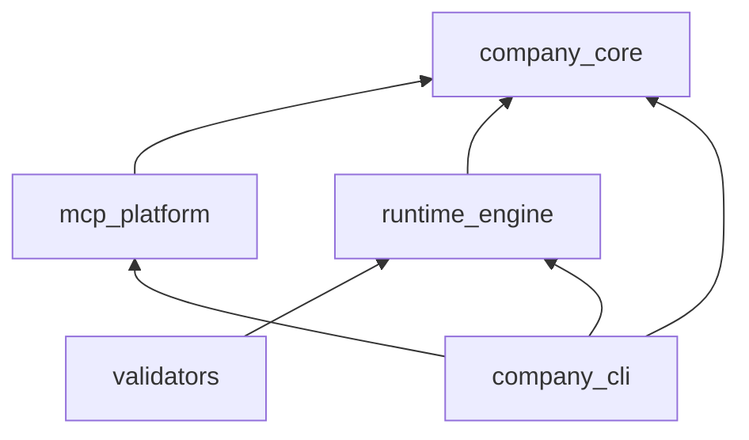

# Dependency Map — AI Company Framework

**Version:** 2.0.0  
**Date:** 2026-07-01  
**Parent:** [framework-architecture.md](./framework-architecture.md)

---

## Layer Dependency Rules

```
L7  User Space          workspaces/, projects/, user assets
         ▲
L6  Application          company_cli, SDK, dashboard
         ▲
L5  Integrations        cursor, vscode adapters
         ▲
L4  Extensions          framework plugins, MCP servers (external)
         ▲
L3  Runtime Kernel      runtime_engine
         ▲
L2  Platform Services   mcp/, mcp_platform, validators, templates
         ▲
L1  Domain Core         workflow, handbook, employees
         ▲
L0  Contracts           company.yaml, runtime/interfaces.md
```

**Rule:** Dependencies point **upward** only. L0–L3 never import L4–L7.

---

## Subsystem Dependency Matrix

|  | L0 | L1 | L2 | L3 | L4 | L5 | L6 | L7 |
|--|:--:|:--:|:--:|:--:|:--:|:--:|:--:|:--:|
| **Manifest** | — | | | | | | ✓ | |
| **Workflow** | | — | | ✓ | | | ✓ | |
| **Handbook** | | — | | | | | ✓ | |
| **Employees** | | — | | | | ✓ | ✓ | |
| **MCP Platform** | | | — | | ✓ | ✓ | ✓ | |
| **mcp_platform** | ✓ | | ✓ | | | | ✓ | |
| **Runtime** | ✓ | ✓ | ✓ | — | ✓ | | ✓ | ✓ |
| **Validators** | | | ✓ | ✓ | | | ✓ | |
| **Templates** | ✓ | ✓ | — | | | | ✓ | ✓ |
| **Integrations** | ✓ | ✓ | ✓ | | | — | ✓ | |
| **CLI** | ✓ | ✓ | ✓ | ✓ | ✓ | ✓ | — | ✓ |
| **Kernel Plugins** | ✓ | | | ✓ | — | | ✓ | |
| **Framework Plugins** | ✓ | | | | — | | ✓ | ✓ |
| **Workspaces** | | | | ✓ | | | ✓ | — |

✓ = may depend on (column is dependency target)

---

## Package Dependency DAG



---

## Forbidden Dependencies

| From | Must NOT import |
|------|-----------------|
| `runtime_engine` | cursor, vscode, openai, anthropic, mcp vendors |
| `company_core` | `runtime_engine`, editors |
| `mcp_platform` | `runtime_engine` (optional loose coupling only) |
| `employees/` content | Any code |
| `handbook/` | Any code |
| Kernel plugins | Other plugins' internals |
| Framework plugins | Kernel engine internals (use events only) |

---

## Data Flow Dependencies

### Project execution

```
Workflow (L1) → Runtime (L3) → State (L7)
                    ↓
              EventBus → Plugins (L4)
                    ↓
              AgentAdapter (L4) → Integration (L5)
```

### MCP resolution

```
Employee (L1) requests Capability
    → mcp/capabilities.yaml (L2)
    → mcp/registry.yaml (L2)
    → MCP Server (L4 external)
```

### CLI operation

```
company CLI (L6)
    → company.yaml (L0)
    → company_core (L2)
    → runtime_engine (L3) | mcp_platform (L2)
```

---

## Coupling Risk Register

| Coupling | Risk | Mitigation |
|----------|------|------------|
| CLI ↔ Runtime | Medium | CLI uses `IRuntime` only |
| Integration ↔ Employees | Low | Symlink, not copy |
| mcp_platform root discovery | Medium | `company_core.resolve_root()` |
| Manifest path hardcoding | High | All paths via manifest |
| Plugin ↔ Kernel state | High | Events only, no mutators |

---

## Future: Distributed Execution

```
Remote Agent Worker (L4)
    ← IAgentAdapter (network)
    ← Runtime (L3) unchanged
```

No new layers — adapter implementation only.

---

## References

- [package-architecture.md](./package-architecture.md)
- [runtime/interfaces.md](../../runtime/interfaces.md) § Dependency Rules
