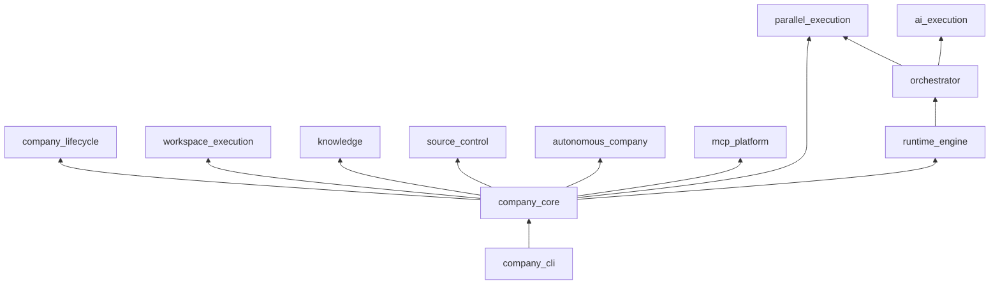

# Dependency Map — AI Company Framework

**Version:** 2.0.0 (alignment 2026-07-02)  
**Date:** 2026-07-01  
**Parent:** [framework-architecture.md](./framework-architecture.md)

---

## Layer Dependency Rules

```
L7  User Space          workspaces/, projects/, .company/ state
         ▲
L6  Application          engineeringos CLI, FrameworkAPI
         ▲
L5  Integrations        .cursor/agents/ (Cursor adapter)
         ▲
L4  Extensions          MCP servers (external), plugins (not wired)
         ▲
L3c AI Execution        ai_execution
         ▲
L3b Orchestrator        orchestrator, parallel_execution
         ▲
L3  Runtime Kernel      runtime_engine
         ▲
L2  Platform Services   lifecycle, workspace_execution, knowledge,
                        source_control, autonomous_company, mcp_platform
         ▲
L1  Domain Core         workflow, handbook, employees
         ▲
L0  Contracts           company.yaml, runtime/interfaces.md
```

**Rule:** Dependencies point **upward** only. L0–L3 never import L4–L7.

---

## Subsystem Dependency Matrix

|  | L0 | L1 | L2 | L3 | L4 | L5 | L6 | L7 |
|--|:--:|:--:|:--:|:--:|:--:|:--:|:--:|:--:|
| **Manifest** | — | | | | | | ✓ | |
| **Workflow** | | — | | ✓ | | | ✓ | |
| **Handbook** | | — | | | | | ✓ | |
| **Employees** | | — | | | | ✓ | ✓ | |
| **MCP Platform** | | | — | | ✓ | ✓ | ✓ | |
| **mcp_platform** | ✓ | | ✓ | | | | ✓ | |
| **Runtime** | ✓ | ✓ | ✓ | — | ✓ | | ✓ | ✓ |
| **Validators** | | | ✓ | ✓ | | | ✓ | |
| **Templates** | ✓ | ✓ | — | | | | ✓ | ✓ |
| **Integrations** | ✓ | ✓ | ✓ | | | — | ✓ | |
| **CLI** | ✓ | ✓ | ✓ | ✓ | ✓ | ✓ | — | ✓ |
| **Kernel Plugins** | ✓ | | | ✓ | — | | ✓ | |
| **Framework Plugins** | ✓ | | | | — | | ✓ | ✓ |
| **Workspaces** | | | | ✓ | | | ✓ | — |

✓ = may depend on (column is dependency target)

---

## Package Dependency DAG



**Note:** `CC --> RT` is a documented monorepo coupling via `ProjectAPI`.

---

## Forbidden Dependencies

| From | Must NOT import |
|------|-----------------|
| `runtime_engine` | cursor, vscode, openai, anthropic, mcp vendors |
| `orchestrator` | provider SDKs directly (uses ai_execution) |
| `ai_execution` | orchestrator internals, CLI |
| `mcp_platform` | `runtime_engine` |
| `employees/` content | Any code |
| `handbook/` | Any code |
| Kernel plugins | Other plugins' internals |
| Framework plugins | Kernel engine internals (use events only) |

**Documented exception:** `company_core` imports `runtime_engine` via `ProjectAPI` — violates original L2 purity rule; accepted for monorepo v1. See [technical-debt.md](../audit/technical-debt.md).

---

## Data Flow Dependencies

### Project execution (implemented)

```
Workflow (L1) → Runtime (L3) → Orchestrator (L3b) → AI Execution (L3c)
                    ↓              ↓
              StateStore      Parallel Execution (policy-gated)
                    ↓
              EventBus → Plugins (L4, not wired)
```

### Autonomous execution (implemented)

```
CEO goal → Autonomous Company → Supervisor → Workspace Execution resume
                ↓                                    ↓
         Decision Engine                      Runtime → Orchestrator
```

### MCP resolution

```
Employee (L1) requests Capability
    → mcp/capabilities.yaml (L2)
    → mcp/registry.yaml (L2)
    → MCP Server (L4 external)
```

### CLI operation (implemented)

```
engineeringos CLI (L6)
    → FrameworkAPI / company_core (L6)
    → platform packages (L2) | runtime_engine (L3)
    → company.yaml (L0)
```

---

## Coupling Risk Register

| Coupling | Risk | Mitigation |
|----------|------|------------|
| CLI ↔ Runtime | Medium | CLI uses `IRuntime` only |
| Integration ↔ Employees | Low | Symlink, not copy |
| mcp_platform root discovery | Medium | `company_core.resolve_root()` |
| Manifest path hardcoding | High | All paths via manifest |
| Plugin ↔ Kernel state | High | Events only, no mutators |

---

## Future: Distributed Execution

```
Remote Agent Worker (L4)
    ← IAgentAdapter (network)
    ← Runtime (L3) unchanged
```

No new layers — adapter implementation only.

---

## References

- [package-architecture.md](./package-architecture.md)
- [runtime/interfaces.md](../../runtime/interfaces.md) § Dependency Rules
