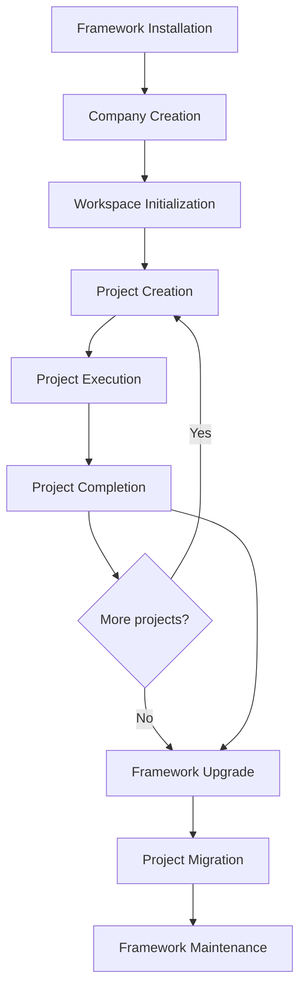

# Framework Lifecycle — AI Company Framework

**Version:** 2.0.0  
**Date:** 2026-07-01  
**Parent:** [framework-architecture.md](./framework-architecture.md)

---

## Lifecycle Overview

---

## Phase 1: Framework Installation

| Attribute | Detail |
|-----------|--------|
| **Trigger** | Developer clones repo or `pip install ai-company-framework` |
| **Actor** | Operator |
| **Actions** | Install packages; verify `mcp_platform validate`; optional `company install --editor cursor` |
| **Outputs** | Framework files on disk; packages in venv |
| **CLI** | `pip install -e packages/mcp_platform` (current); future meta-package |
| **Failure** | Missing deps; doctor fails |
| **Persistence** | Framework root path |

---

## Phase 2: Company Creation

| Attribute | Detail |
|-----------|--------|
| **Trigger** | First-time setup or new isolated company |
| **Actor** | Operator |
| **Actions** | `company init`; write `company.yaml`; scaffold `workspaces/` |
| **Outputs** | Company Instance |
| **Events** | `CompanyCreated` |
| **Failure** | Path exists; invalid config |
| **Persistence** | `company.yaml`, `company.lock` |

---

## Phase 3: Workspace Initialization

| Attribute | Detail |
|-----------|--------|
| **Trigger** | `company open <id>` or first `project create` |
| **Actor** | Operator |
| **Actions** | Create `workspaces/<id>/`; write `workspace.yaml`; init `.company/` |
| **Outputs** | Active workspace |
| **Events** | `WorkspaceOpened` |
| **Persistence** | Workspace directory (gitignored from framework) |

---

## Phase 4: Project Creation

| Attribute | Detail |
|-----------|--------|
| **Trigger** | `company project create <id>` or EM starts initiative |
| **Actor** | EM / Operator |
| **Actions** | Scaffold templates; `IRuntime.init_project`; write `idea.md`, `pipeline-status.md` |
| **Outputs** | Project at phase 0 |
| **Events** | `ProjectCreated` (kernel) |
| **Gate** | G0 pending |
| **Persistence** | `projects/<id>/`, `state/<id>.json` |

---

## Phase 5: Project Execution

| Attribute | Detail |
|-----------|--------|
| **Trigger** | EM advances SDLc |
| **Actor** | Employees via EM orchestration |
| **Actions** | Phases 0–9; gate validation; MCP evidence; rework loops |
| **Outputs** | Phase artifacts; gate history |
| **Runtime** | Enforces workflow; persists state; publishes events |
| **Failure** | Gate fail (3 strikes → blocked); STOP conditions |
| **Persistence** | Artifacts + state + events |

Sub-phases: Idea → Requirements → … → Review → Release

---

## Phase 6: Project Completion

| Attribute | Detail |
|-----------|--------|
| **Trigger** | G9 passed; `closure.md` complete |
| **Actor** | EM + user |
| **Actions** | `IRuntime.close`; archive optional |
| **Outputs** | Closed project |
| **Events** | `ProjectClosed` |
| **CLI** | `company project archive` |
| **Persistence** | Final artifacts; state read-only |

---

## Phase 7: Framework Upgrade

| Attribute | Detail |
|-----------|--------|
| **Trigger** | New framework release |
| **Actor** | Operator |
| **Actions** | `company upgrade`; update pin; `company doctor` |
| **Outputs** | New `framework.version` |
| **Events** | `FrameworkUpgraded` |
| **Compatibility** | See [versioning-strategy.md](./versioning-strategy.md) |
| **Failure** | Major without migrate |

---

## Phase 8: Project Migration

| Attribute | Detail |
|-----------|--------|
| **Trigger** | Major framework/kernel/workflow upgrade |
| **Actor** | Operator + EM |
| **Actions** | `company migrate`; per-project state schema upgrade; workflow pin decision |
| **Outputs** | Migrated projects or archived on old pin |
| **Failure** | Incompatible state — restore from `.bak` |
| **CLI** | `company migrate [--project ID] [--dry-run]` |

---

## Phase 9: Framework Maintenance

| Attribute | Detail |
|-----------|--------|
| **Trigger** | Ongoing |
| **Actor** | Framework maintainers |
| **Actions** | Registry updates; handbook patches; employee prompt patches; security |
| **Outputs** | Patch/minor releases |
| **Process** | SDLc on framework repo itself (`projects/` for design history) |
| **CI** | `mcp_platform validate`; manifest schema tests; doctor in CI |

---

## Lifecycle Actors

| Actor | Phases |
|-------|--------|
| Operator | 1, 2, 3, 7, 8 |
| EM | 4, 5, 6 |
| Employees | 5 |
| Runtime | 5, 6 |
| Maintainers | 7, 9 |

---

## References

- [workspace-model.md](./workspace-model.md)
- [cli-architecture.md](./cli-architecture.md)
- [domain-model.md](./domain-model.md)
