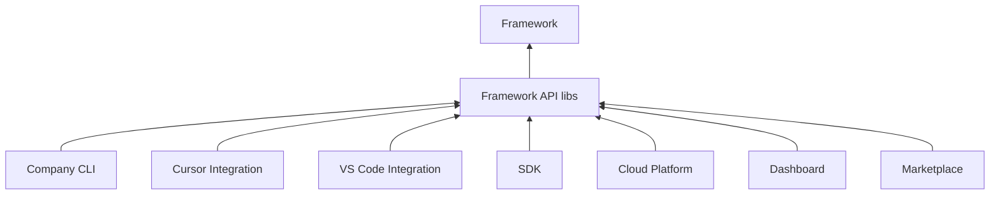

# Product Ecosystem — AI Company Framework

**Version:** 2.0.0  
**Date:** 2026-07-01  
**Parent:** [framework-architecture.md](./framework-architecture.md)

---

## Principle

The **Framework is the core product**. All other products are **consumers** of the Framework API — they add delivery channels, not duplicate SDLc logic.

```
                    ┌─────────────────┐
                    │  AI Company      │
                    │  Framework       │
                    │  (core product)  │
                    └────────┬────────┘
                             │ Framework API
        ┌────────────────────┼────────────────────┐
        ▼                    ▼                    ▼
   Company CLI         Editor Products      Platform Products
```

---

## Product Catalog

| Product | Status | Consumes | Delivers |
|---------|--------|----------|----------|
| **AI Company Framework** | Shipped (content) | — | SDLc, employees, MCP, contracts |
| **Company CLI** | Planned | Framework API | Operator commands |
| **Cursor Integration** | Partial (.cursor/) | IntegrationAPI | Agent + MCP sync |
| **VS Code Integration** | Planned | IntegrationAPI | Extension + MCP |
| **Claude Code Integration** | Planned | IntegrationAPI | Agent config sync |
| **Roo Code Integration** | Planned | IntegrationAPI | Agent config sync |
| **Python SDK** | Stub | Framework API | Programmatic orchestration |
| **TypeScript SDK** | Planned | Framework API | Editor/cloud bindings |
| **Cloud Platform** | Planned | Framework API + REST | Remote runtime, fleet |
| **Dashboard** | Planned | EventAPI | Live pipeline monitoring |
| **Marketplace** | Planned | PluginAPI | Plugin distribution |
| **REST API** | Planned | Framework API | HTTP gateway to cloud |
| **Language Server** | Future | EmployeeAPI + ProjectAPI | IDE phase hints |

---

## Product Boundaries

| Product | Owns | Must NOT Own |
|---------|------|--------------|
| Framework | Workflow, handbook, employees, contracts | User code, editor UI |
| CLI | Command UX, exit codes | Gate logic, validation rules |
| Editor integration | Sync, discovery | SDLc rules, employee content |
| SDK | Language bindings | Duplicate Runtime |
| Cloud | Hosting, scaling | Workflow definitions |
| Dashboard | Visualization | Pipeline enforcement |
| Marketplace | Discovery, trust | Plugin execution internals |

---

## Dependency Graph



**No product depends on another product** — all depend on Framework API only.

---

## Company CLI

| Attribute | Value |
|-----------|-------|
| Package | `packages/company_cli` |
| API | Full Framework API |
| Role | Primary operator interface |
| Doc | [cli-architecture.md](./cli-architecture.md) |

---

## Editor Products

| Editor | Integration path | Sync mechanism |
|--------|------------------|----------------|
| Cursor | `integrations/cursor/` | `company install --editor cursor` |
| VS Code | `integrations/vscode/` | Extension reads manifest |
| Claude Code | `integrations/claude-code/` | Config export |
| Roo Code | `integrations/roo-code/` | Config export |

All: **adapters only** — see [integration-architecture.md](./integration-architecture.md).

---

## SDK

| Binding | Package | Status |
|---------|---------|--------|
| Python | `ai-company-sdk` | `test_sdk.py` stub |
| TypeScript | `@ai-company/sdk` | Planned |

Exposes: `Company.open()`, `Workspace.projects`, `Project.runtime`, `Employee.delegate()`.

---

## Cloud Platform (Future)

| Service | Responsibility |
|---------|----------------|
| Runtime hosting | Remote `IRuntime` |
| Agent workers | `IAgentAdapter` remote impl |
| State store | Distributed `IStateStore` |
| Fleet management | Multi company instance |

Architecture requires **no kernel contract changes** — adapter + store plugins.

---

## Dashboard (Future)

- Subscribes to `EventAPI` / kernel events
- Reads `company status` via Framework API
- Does not enforce gates

---

## Marketplace (Future)

- Distributes framework plugins + MCP registry extensions
- Trust signing (future)
- `company plugin install <id>`

---

## REST API (Future)

HTTP mapping of Framework API for cloud and external tools:

```
GET  /v1/companies/{id}/status
POST /v1/workspaces/{ws}/projects
POST /v1/projects/{id}/advance
```

OpenAPI generated from Framework API contracts (future).

---

## Language Server (Future)

- Phase-aware hints in IDE
- Reads `ProjectAPI` + `EmployeeAPI`
- No code generation of business logic

---

## Release Strategy

| Product | Release cycle |
|---------|---------------|
| Framework | Semver — core releases |
| CLI | Tied to framework minor |
| Integrations | Independent per editor |
| SDK | Independent — `min_framework_version` |
| Cloud | Independent SaaS |

---

## Anti-Patterns

1. Duplicating workflow in CLI — **forbidden**
2. Editor-specific gate logic — **forbidden**
3. SDK bypassing Framework API to read `handbook/` — **forbidden**
4. Cloud fork of kernel — **forbidden** — use `IAgentAdapter`

---

## References

- [framework-api.md](./framework-api.md)
- [ADR-0008](../adr/0008-product-ecosystem.md)
