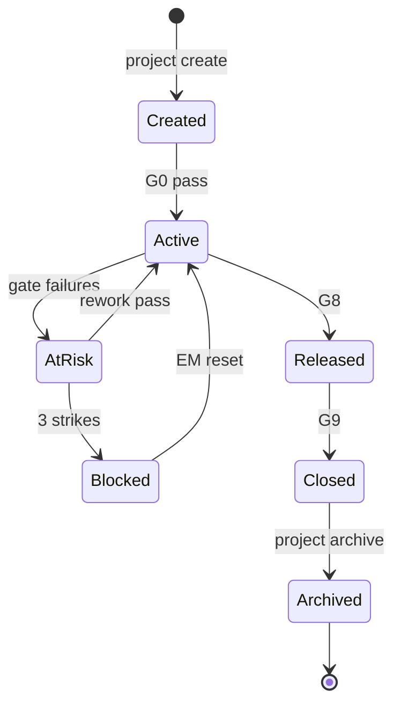

# Project Model — AI Company Framework

**Version:** 2.0.0  
**Date:** 2026-07-01  
**Parent:** [framework-architecture.md](./framework-architecture.md)

---

## Definition

A **Project** is a single **SDLc execution** — one initiative from Idea (phase 0) through Closure (phase 9), producing a coherent set of artifacts and optionally source code.

---

## Purpose

- Encapsulate one deliverable initiative
- Enforce workflow gates G0–G9
- Produce traceable artifacts (`idea.md` → `closure.md`)
- Maintain resumable pipeline state
- Isolate from other parallel projects

---

## Lifecycle



| State | `ProjectStatus` (kernel) | Description |
|-------|--------------------------|-------------|
| Created | — | Scaffolded, pre-G0 |
| Active | `active` | Phases in progress |
| At Risk | `at_risk` | Gate failures < max |
| Blocked | `blocked` | Max gate failures |
| Released | `released` | G8 passed |
| Closed | `closed` | G9 passed |
| Archived | — | Read-only, moved optional |

---

## Artifacts

### Phase artifacts (framework-defined)

| Phase | Artifact | Owner |
|-------|----------|-------|
| 0 | `idea.md` | EM |
| 1 | `requirements.md` | PM |
| 2 | `spec.md` | BA |
| 3 | `tasks.md` | Planner |
| 4 | `architecture.md` | Architect |
| 5 | source + tests | Implementers |
| 6 | `qa-report.md` | QA |
| 7 | `review.md` | Reviewer |
| 8 | `release.md` | EM |
| 9 | `closure.md` | EM |
| All | `pipeline-status.md` | EM |

### Generated documents (runtime)

| Artifact | Location | Disposable |
|----------|----------|------------|
| `state.json` | `.company/state/<id>.json` | On archive |
| `events.jsonl` | `.company/events/<id>.jsonl` | On archive |
| Synced status | `pipeline-status.md` | User artifact |

### User documents

| Type | Examples | Owner |
|------|----------|-------|
| Notes | `notes/`, ADRs in project | User |
| Config | `.env`, local overrides | User |
| Assets | designs, screenshots | User |

### Source code

| Type | Location | Phase |
|------|----------|-------|
| Implementation | `src/`, per `architecture.md` | 5 |
| Tests | `tests/` | 5 |
| Infrastructure | `deploy/`, `docker/` | 5+ |

---

## Pipeline

Projects follow **Workflow** loaded from framework — never embedded in project.

```
Idea → Requirements → Spec → Planning → Architecture
  → Implementation → Testing → Review → Release → Closure
```

**Runtime** enforces transitions. **EM** orchestrates. **Employees** produce artifacts.

---

## Ownership

| Concern | Owner |
|---------|-------|
| Phase artifacts | Phase owner (handbook) |
| Pipeline orchestration | EM |
| Project state | Runtime |
| Source code | Implementers |
| User docs | User |

---

## Versioning

```yaml
# .company-project.yaml
project:
  id: auth-service
  created_at: 2026-07-01
  workflow_version: "1.0"
  framework_version: "2.0.0"
  kernel_contract_version: "1.0.0"
  template_version: "2.0.0"
  status: active
  current_phase: planning
```

Projects **pin** workflow at creation. Migration explicit via `company migrate --project`.

---

## Project Status

Surfaced via `company status` and `IRuntime.status()`:

| Field | Source |
|-------|--------|
| `current_phase_id` | Runtime state |
| `gate_strikes` | Runtime state |
| `blockers` | EM + validators |
| `open_rework` | Rework history |
| `next_agent` | Agent registry |

---

## Relationships

```
Company Instance
    └── Workspace
            └── Project (this)
                    ├── Artifacts (markdown, code)
                    ├── Runtime State
                    └── Events
```

- **Workspace:** Parent container; shared `.company/` infrastructure
- **Company Instance:** Version pins, company-wide policies
- **Framework:** Workflow + employees + validators (read-only)

---

## Directory Structure

```
workspaces/<ws>/projects/<project-id>/
├── .company-project.yaml
├── pipeline-status.md
├── idea.md … closure.md
├── src/                          # phase 5+
├── tests/
├── notes/                        # user docs
└── .env                          # user — not committed
```

Runtime state: `workspaces/<ws>/.company/state/<project-id>.json`

---

## Multi-Project Rules

| Rule | Description |
|------|-------------|
| Unique `project-id` | Within workspace |
| No shared artifact dirs | Except explicit monorepo choice by user |
| Independent state | Per `project_id` |
| Parallel allowed | EM manages each pipeline |

---

## Extension Points

- Custom validators registered per project (via Runtime)
- Template variants at project creation
- Workspace-level employee overrides affect delegation

---

## References

- [workspace-model.md](./workspace-model.md)
- [runtime/interfaces.md](../../runtime/interfaces.md)
- [ADR-0005](../adr/0005-project-model.md)
