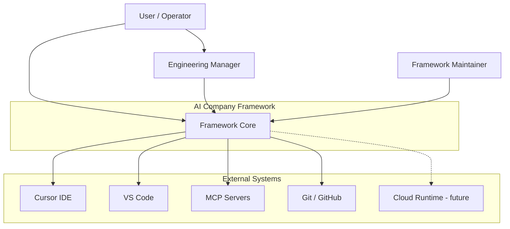
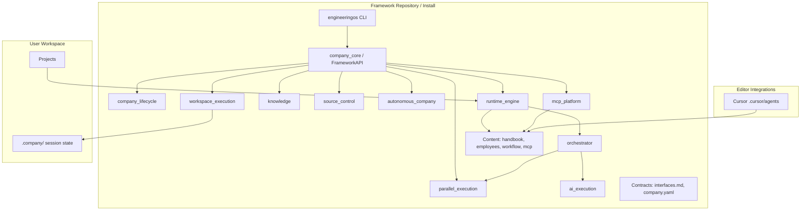
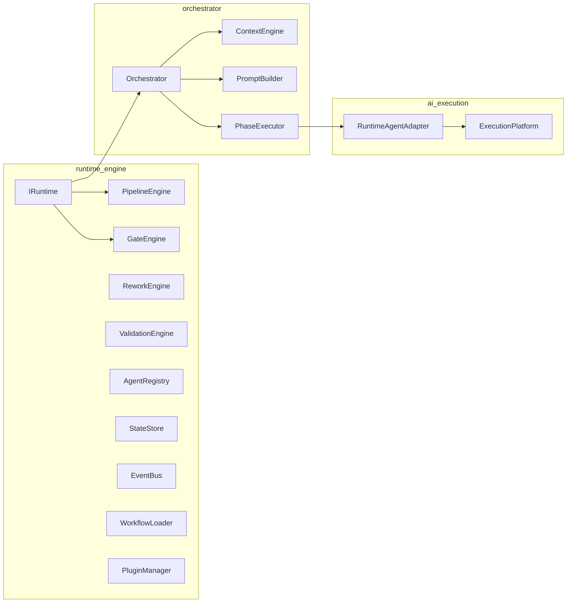

# System Context — AI Company Framework

**Version:** 2.0.0 (alignment 2026-07-02)  
**Date:** 2026-07-01  
**Parent:** [framework-architecture.md](./framework-architecture.md)

---

## C4 Level 1 — System Context



### Actors

| Actor | Interacts via | Goal |
|-------|---------------|------|
| **User / Stakeholder** | EM, CLI | Ship software through SDLc |
| **Engineering Manager** | Employees, Runtime | Orchestrate pipeline |
| **Framework Maintainer** | Git, SDLc | Evolve framework |
| **Specialist Employees** | Integrations | Produce artifacts |
| **CI/CD** | CLI `doctor`, `validate` | Gate framework health |

---

## C4 Level 2 — Containers



### Container Descriptions

| Container | Technology | Responsibility |
|-----------|------------|----------------|
| **engineeringos CLI** | Python/Typer | Operator interface via `get_api()` |
| **company_core** | Python | `FrameworkAPI` aggregate |
| **company_lifecycle** | Python | init, workspaces, projects, templates |
| **workspace_execution** | Python | Session, context, resume |
| **runtime_engine** | Python | Kernel — lifecycle, gates, state |
| **orchestrator** | Python | Sequencing, context, prompts |
| **ai_execution** | Python | Provider boundary |
| **knowledge / source_control / parallel_execution / autonomous_company** | Python | Platform services |
| **mcp_platform** | Python | MCP validation |
| **Content packages** | Markdown/YAML | Policies, agents, workflow |
| **Contracts** | Markdown/YAML | Stable APIs |
| **Workspace** | Filesystem | User projects + `.company/` state |
| **Integrations** | Config | `.cursor/agents/` (partial) |

---

## C4 Level 3 — Runtime Components



See [runtime/interfaces.md](../../runtime/interfaces.md) for interface details.

---

## Deployment Views

### Local Developer (Current)

```
Developer Machine
├── Framework install (engineeringos repo)
├── .venv (local, not in git)
├── company.yaml (instance manifest)
├── workspaces/default/
│   └── projects/<feature>/
└── Cursor IDE → .cursor/agents/
```

### Installed Package (Future)

```
pip install ai-company-framework
~/.local/share/ai-company/<version>/
~/projects/my-workspace/
company init / company open / company project create
```

### Cloud Execution (Future)

```
Company CLI (local) ──► Remote Runtime API
                              │
                         Agent Workers
                              │
                         MCP Proxy
```

Architecture supports without container changes — `IAgentAdapter` + remote state store.

---

## Trust Boundaries

| Boundary | Inside | Outside |
|----------|--------|---------|
| **Framework core** | handbook, employees, contracts | User project code |
| **Workspace** | User artifacts, state | Framework git |
| **MCP** | Registry, policies | MCP server processes |
| **Secrets** | Env vars, user config | Never in framework git |

---

## References

- [framework-architecture.md](./framework-architecture.md)
- [domain-model.md](./domain-model.md)
