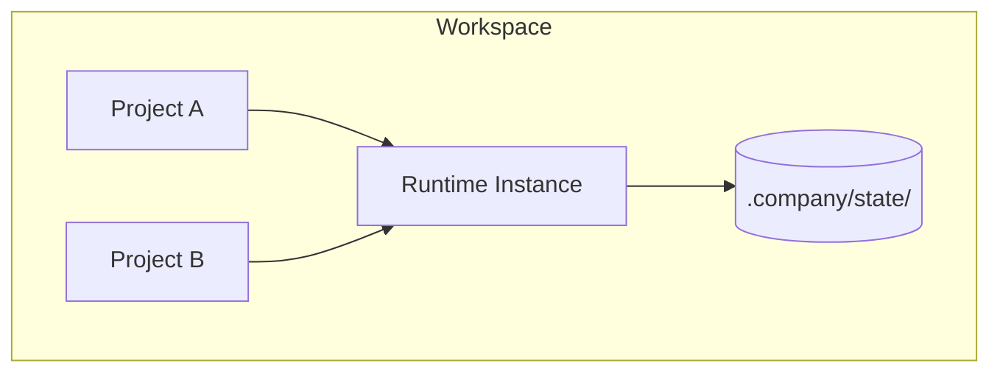

# Workspace Model — AI Company Framework

**Version:** 2.0.0  
**Date:** 2026-07-01  
**Parent:** [framework-architecture.md](./framework-architecture.md)

---

## Purpose

Define what belongs in a **Workspace**, what stays in the **Framework**, and what lives in a **Project** — including multi-project coexistence, artifact isolation, and upgrade behavior.

---

## Hierarchy

```
Company Instance (company.yaml)
└── workspaces/
    └── <workspace-id>/
        ├── .company/
        │   ├── workspace.yaml          # Workspace metadata
        │   ├── state/                  # Runtime state (all projects)
        │   │   └── <project-id>.json
        │   ├── events/                 # Event logs
        │   │   └── <project-id>.jsonl
        │   └── cache/                  # Temporary tool cache
        ├── projects/
        │   ├── <project-id-a>/         # Project A artifacts
        │   │   ├── pipeline-status.md
        │   │   ├── idea.md … closure.md
        │   │   └── src/                # Implementation (phase 5)
        │   └── <project-id-b>/         # Project B (parallel)
        ├── extensions/                 # Framework extensions (optional)
        ├── employees/                  # Prompt overrides (optional)
        └── user/                       # User assets (configs, notes)
```

---

## What Belongs Where

### Framework (never in workspace)

| Asset | Path (target layout) |
|-------|---------------------|
| Handbook | `handbook/` |
| Employees (canonical) | `employees/` |
| Workflow | `workflow/` |
| MCP registry | `mcp/` |
| Kernel contracts | `runtime/interfaces.md` |
| Packages | `packages/` |
| Templates | `templates/` |
| Integration templates | `integrations/` |

### Workspace (user environment)

| Asset | Purpose |
|-------|---------|
| `.company/workspace.yaml` | Workspace id, schema version, framework pin |
| `.company/state/` | Runtime persistence — all projects |
| `.company/events/` | Audit / plugin feed |
| `projects/` | All active and archived projects |
| `extensions/` | User-installed framework extensions |
| `employees/` | Optional prompt overrides |

### Project (SDLc unit)

| Asset | Phase | Owner |
|-------|-------|-------|
| `pipeline-status.md` | All | EM |
| `idea.md` | 0 | EM |
| `requirements.md` | 1 | PM |
| `spec.md` | 2 | BA |
| `tasks.md` | 3 | Planner |
| `architecture.md` | 4 | Architect |
| Source + tests | 5 | Implementers |
| `qa-report.md` | 6 | QA |
| `review.md` | 7 | Reviewer |
| `release.md` | 8 | EM |
| `closure.md` | 9 | EM |

---

## Multi-Project Coexistence

| Rule | Description |
|------|-------------|
| **Isolation** | Projects do not share artifact directories |
| **Shared runtime** | One Runtime instance per workspace; `project_id` scopes state |
| **Parallel projects** | Allowed — EM manages each `pipeline-status.md` independently |
| **Cross-project refs** | Forbidden in artifacts unless explicit dependency documented |
| **Naming** | `project-id` unique within workspace (slug) |



---

## Generated Artifact Isolation

| Generated Type | Location | Framework Git | Disposable |
|----------------|----------|---------------|------------|
| Pipeline state | `.company/state/<id>.json` | No | On archive |
| Event log | `.company/events/<id>.jsonl` | No | On archive |
| Synced pipeline-status | `projects/<id>/pipeline-status.md` | User choice | No — user artifact |
| Build output | `projects/<id>/dist/` | User choice | Yes |
| Meta reports | `docs/reports/` (framework only) | Yes | Framework history |

**Rule:** Generated runtime state **never** copied into framework repository.

---

## Framework Upgrade Impact

| Scenario | Behavior |
|----------|----------|
| **Patch upgrade** (1.0.x) | Transparent; run `company doctor` |
| **Minor upgrade** (1.x.0) | New templates; existing projects continue on pinned workflow version |
| **Major upgrade** (x.0.0) | `company migrate` may required; projects pin until migrated |
| **Workflow version bump** | New projects use new workflow; active projects finish on old pin |
| **Employee prompt update** | Applies to new delegations; no retroactive artifact rewrite |
| **Kernel contract major** | Runtime migration; state `schema_version` upgrade path |

### Project Pinning

```yaml
# projects/my-feature/.company-project.yaml
project_id: my-feature
workflow_version: "1.0"
framework_version: "1.0.0"
kernel_contract_version: "1.0.0"
```

Runtime refuses incompatible combinations; CLI `company doctor` reports drift.

---

## Workspace Lifecycle

| State | Description | CLI |
|-------|-------------|-----|
| `uninitialized` | Directory does not exist | — |
| `active` | Contains projects | `company open` |
| `archived` | Read-only; no new projects | `company project archive` |
| `deleted` | Removed from disk | manual |

---

## Default vs Named Workspaces

| Mode | Path | Use case |
|------|------|----------|
| **Default** | `workspaces/default/` | Single developer |
| **Named** | `workspaces/<team>/` | Team isolation |
| **External** | User-specified path | Monorepo embedding |

`company.yaml` declares `workspaces.root` and optional `workspaces.default`.

---

## Anti-Patterns (Forbidden)

1. User project artifacts at framework root
2. Framework handbook edits inside workspace
3. Committing `.company/state/` to framework git
4. Sharing `project-id` across workspaces without export/import
5. Hardcoding framework paths in project artifacts (use relative paths)

---

## References

- [domain-model.md](./domain-model.md)
- [ADR-0003](../adr/0003-workspace-model.md)
- [lifecycle.md](./lifecycle.md)
