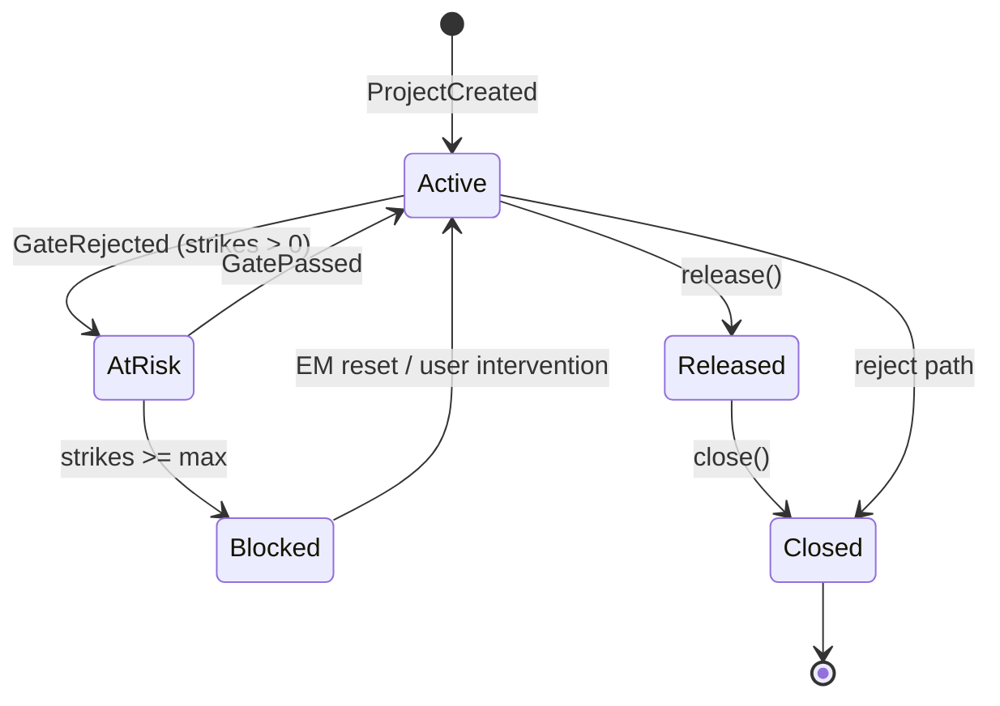
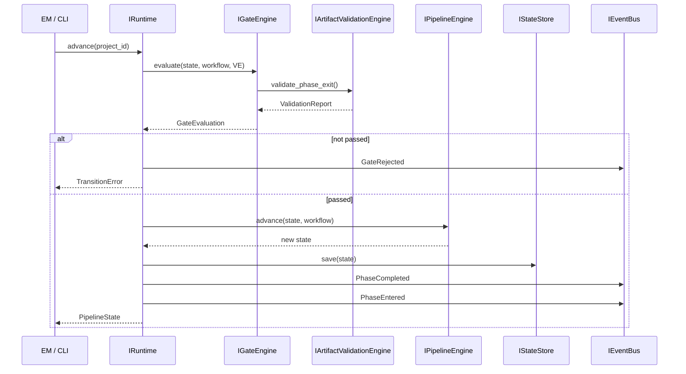
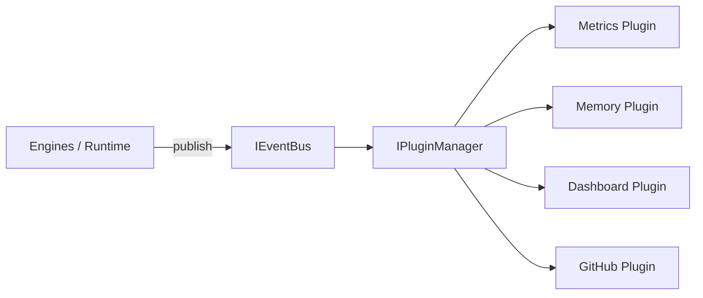
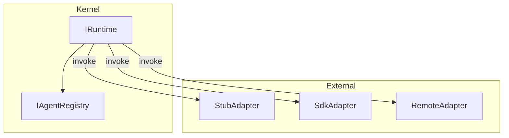

# Company Kernel — Public Interface Specification

**Document:** Canonical API Constitution  
**Version:** 1.0.0  
**Status:** Frozen (design approved)  
**Date:** 2026-07-01  
**Authority:** This document supersedes informal API sketches in `runtime/architecture.md` for all public contracts.

---

## Table of Contents

1. [Purpose & Scope](#1-purpose--scope)
2. [Design Principles](#2-design-principles)
3. [Dependency Rules](#3-dependency-rules)
4. [Versioning Strategy](#4-versioning-strategy)
5. [Shared Types](#5-shared-types)
6. [State Model](#6-state-model)
7. [Workflow Loader](#7-workflow-loader)
8. [Runtime Facade](#8-runtime-facade)
9. [Pipeline Engine](#9-pipeline-engine)
10. [Gate Engine](#10-gate-engine)
11. [Rework Engine](#11-rework-engine)
12. [Artifact Validation Engine](#12-artifact-validation-engine)
13. [Agent Registry](#13-agent-registry)
14. [Agent Adapter](#14-agent-adapter)
15. [State Store](#15-state-store)
16. [Event Bus](#16-event-bus)
17. [Plugin System](#17-plugin-system)
18. [CLI Commands](#18-cli-commands)
19. [Event Catalog](#19-event-catalog)
20. [Lifecycle Diagrams](#20-lifecycle-diagrams)
21. [Extension Points](#21-extension-points)
22. [Error Taxonomy](#22-error-taxonomy)

---

## 1. Purpose & Scope

This document defines the **public contracts** for the Company Kernel — the operating system of the AI Company. Implementations MUST conform to these interfaces. Implementations MAY be replaced entirely (language, storage, orchestration) without changing this specification.

**In scope:** Interface responsibilities, method signatures (illustrative), inputs/outputs, failure modes, extension points, events, state model, CLI behavior.

**Out of scope:** Python module layout, class implementations, vendor SDK types, Cursor-specific behavior.

### 1.1 Implementation Alignment (2026-07-02)

This contract remains **frozen at v1.0.0**. The live implementation adds approved layers and facade methods documented here for transparency — not as contract changes.

| Extension | Location | Notes |
|-----------|----------|-------|
| **Orchestrator layer** | `packages/orchestrator` | Sequences employees; sole live `adapter.invoke()` path |
| **AI Execution layer** | `packages/ai_execution` | Provider boundary below Orchestrator |
| `execute_planning_pipeline` | `IRuntime` facade | Delegates to Orchestrator |
| `pause` / `resume` / `history` | `IRuntime` facade | Lifecycle extensions |
| `ProjectStatus.PAUSED` | `runtime_engine.types` | Beyond §5 enum — used by pause model |
| `register_plugin` | `IRuntime` facade | Raises `NotImplementedError` |
| Platform packages | L2 services | lifecycle, workspace_execution, knowledge, source_control, parallel_execution, autonomous_company — consumed via Framework API, not kernel |

**Execution flow (implemented):** Runtime → Orchestrator → AI Execution → Employees.

**Compliance matrix:** [docs/audit/architecture-compliance.md](../docs/audit/architecture-compliance.md).  
**Recommended:** Minor contract bump (v1.1) to formalize orchestrator layer in §3 — documentation only.

---

## 2. Design Principles

| # | Principle | Contract Enforcement |
|---|-----------|---------------------|
| 1 | Workflow-driven | Phase/gate/owner/transition data from `IWorkflowLoader` only |
| 2 | Adapter architecture | `IAgentAdapter` is the sole agent invocation boundary |
| 3 | Event-driven | Engines publish via `IEventBus`; no direct cross-engine callbacks |
| 4 | Plugin architecture | `IPlugin` subscribes to events; no kernel modification |
| 5 | Stable interfaces | Breaking changes require major version bump |
| 6 | Resumable state | `PipelineState` fully serializable via `IStateStore` |
| 7 | Replaceable storage | `IStateStore` is pluggable |
| 8 | Future-compatible | Extension points for parallel, distributed, remote execution |

---

## 3. Dependency Rules

```
                    ┌─────────────┐
                    │  CLI / SDK  │  L5 Application
                    └──────┬──────┘
                           │ uses IRuntime only
                    ┌──────▼──────┐
                    │  IRuntime   │  L1 Facade
                    └──────┬──────┘
         ┌─────────────────┼─────────────────┐
         ▼                 ▼                 ▼
   IPipelineEngine   IGateEngine      IStateStore     L1 Domain
   IReworkEngine     IArtifactValEng  IEventBus
   IAgentRegistry    IWorkflowLoader  IPluginManager
         │                 │
         ▼                 ▼
   Shared Types      WorkflowDefinition   L0 Contracts
   PipelineState     KernelEvent

   IAgentAdapter ──► L3 (implements L0 only)
   IPlugin       ──► L4 (implements L0 only)
```

**MUST NOT:**

- Domain engines import adapter or plugin implementations
- Adapters import kernel engine internals
- Plugins import adapters or mutate kernel state directly
- Public interfaces reference vendor types (OpenAI, Anthropic, Cursor, MCP handles)

---

## 4. Versioning Strategy

### 4.1 Contract Version (this document)

| Bump | When |
|------|------|
| **Major** | Remove/rename public method; breaking event payload change; incompatible state schema |
| **Minor** | Add interface method with documented default; add optional event field; add new event type |
| **Patch** | Clarify documentation; non-normative examples |

### 4.2 State Schema Version

`PipelineState.schema_version` (string, semver). Loaders MUST reject unknown major versions. Minor versions MAY add optional fields with defaults.

### 4.3 Workflow Version

`PipelineState.workflow_version` mirrors `workflow.yaml` `version` field. Mismatch emits `WorkflowVersionMismatch` event; transition blocked until EM resolves.

### 4.4 Plugin Compatibility

Plugins declare `supported_contract_version: string` in `PluginInfo`. `IPluginManager` rejects plugins below current major.

---

## 5. Shared Types

Illustrative signatures — not implementation code.

```python
# Identifiers (all strings; values from workflow.yaml, never enum-hardcoded in kernel)
PhaseId = str          # e.g. "requirements"
GateId = str           # e.g. "G1"
ProjectId = str
AgentId = str
ArtifactName = str     # e.g. "requirements.md"
SymptomId = str        # rework_routing key
PluginId = str
SubscriptionId = str

# Enums (kernel-defined, workflow-agnostic)
class ProjectStatus(Enum):
    ACTIVE = "active"
    AT_RISK = "at_risk"
    BLOCKED = "blocked"
    RELEASED = "released"
    CLOSED = "closed"

class PhaseStatus(Enum):
    PENDING = "pending"
    IN_PROGRESS = "in_progress"
    PASS = "pass"
    FAIL = "fail"
    SKIPPED = "skipped"

class ValidationSeverity(Enum):
    ERROR = "error"
    WARNING = "warning"
    INFO = "info"

class AdapterStatus(Enum):
    PENDING = "pending"       # human action required
    COMPLETED = "completed"
    FAILED = "failed"
    DELEGATED = "delegated"   # async remote job

# References
@dataclass
class ArtifactRef:
    name: ArtifactName
    path: str                 # relative to artifact_root
    owner_agent: AgentId | None
    required: bool

@dataclass
class TransitionDecision:
    allowed: bool
    reason: str | None
    blockers: list[str]

@dataclass
class ValidationError:
    code: str
    message: str
    severity: ValidationSeverity
    artifact: ArtifactName | None = None
    path: str | None = None

@dataclass
class ValidationResult:
    passed: bool
    errors: list[ValidationError]
    warnings: list[ValidationError]
    checks_run: list[str]

@dataclass
class ValidationReport:
    phase_id: PhaseId
    passed: bool
    results: list[ValidationResult]
    timestamp: datetime

@dataclass
class GateEvaluation:
    gate_id: GateId
    phase_id: PhaseId
    passed: bool
    errors: list[str]
    artifact_results: list[ValidationResult]
    strike_count: int
    max_strikes: int

@dataclass
class GateRecord:
    gate_id: GateId
    phase_id: PhaseId
    passed: bool
    timestamp: datetime
    notes: str
    evaluator: str              # "em" | "user" | "system"
    user_approved: bool
    metadata: dict[str, Any]

@dataclass
class ReworkRecord:
    id: str                       # RW-001, monotonic per project
    timestamp: datetime
    from_phase_id: PhaseId
    to_phase_id: PhaseId
    symptom: SymptomId
    reason: str
    resolved: bool
    resolved_at: datetime | None

@dataclass
class AgentDescriptor:
    agent_id: AgentId
    role: str
    phase_id: PhaseId
    primary_artifact: ArtifactName
    parallel: bool
    contributors: list[AgentId]

@dataclass
class AdapterResult:
    status: AdapterStatus
    agent_id: AgentId
    phase_id: PhaseId
    message: str
    job_id: str | None          # for async/remote
    artifacts_touched: list[str]
    metadata: dict[str, Any]

@dataclass
class ProjectStatusView:
    project_id: ProjectId
    status: ProjectStatus
    current_phase_id: PhaseId
    current_gate_id: GateId | None
    phase_status: dict[PhaseId, PhaseStatus]
    gate_strikes: dict[GateId, int]
    blockers: list[str]
    last_gate: GateRecord | None
    open_rework: ReworkRecord | None
    next_agent: AgentDescriptor | None
```

---

## 6. State Model

`PipelineState` is the single authoritative in-memory representation. MUST be fully serializable.

### 6.1 Top-Level Structure

```python
@dataclass
class PipelineState:
  # ── Project ──
    project_id: ProjectId
    status: ProjectStatus
    artifact_root: str              # relative path from projects root
    workflow_version: str
    workflow_path: str
    created_at: datetime
    updated_at: datetime
    metadata: dict[str, Any]

  # ── Phase ──
    current_phase_id: PhaseId
    phase_status: dict[PhaseId, PhaseStatus]
    skip_risk_accepted: dict[GateId, bool]

  # ── Gate ──
    gate_strikes: dict[GateId, int]

  # ── Artifact (tracking, not content) ──
    artifact_index: dict[ArtifactName, ArtifactRecord]

  # ── Rework ──
    rework_history: list[ReworkRecord]

  # ── History ──
    gate_history: list[GateRecord]
    transition_history: list[TransitionRecord]

  # ── Execution ──
    execution: ExecutionState

  # ── Schema ──
    schema_version: str             # PipelineState format version
```

### 6.2 Section Definitions

#### Project
Core identity and lifecycle status. `metadata` holds user-defined tags (never secrets).

#### Phase
`current_phase_id` is the active phase. `phase_status` maps every phase from workflow to status. Kernel never assumes fixed phase count.

#### Gate
`gate_strikes` tracks failures per gate_id. Compared against `WorkflowDefinition.defaults.max_gate_failures`.

#### Artifact
```python
@dataclass
class ArtifactRecord:
    name: ArtifactName
    path: str
    owner_agent: AgentId | None
    last_validated_at: datetime | None
    validation_status: PhaseStatus | None
    version: str | None             # optional content hash or semver
    approved: bool
```

#### Rework
Append-only `rework_history`. Open rework = latest record with `resolved=False`.

#### History
```python
@dataclass
class TransitionRecord:
    timestamp: datetime
    from_phase_id: PhaseId
    to_phase_id: PhaseId
    gate_id: GateId | None
    trigger: str                    # "advance" | "rework" | "init" | "release" | "close"
```

#### Execution
```python
@dataclass
class ExecutionState:
    parallel_tracks: list[ParallelTrack]
    active_agent_id: AgentId | None
    last_invocation_at: datetime | None
    invocation_count: int

@dataclass
class ParallelTrack:
    track_id: str
    agent_id: AgentId
    phase_id: PhaseId
    status: PhaseStatus
    merge_complete: bool
```

Supports future parallel backend/frontend tracks without contract change.

### 6.3 Resumability Guarantees

1. `IStateStore.save(state)` persists complete state atomically
2. `IStateStore.load(project_id)` restores exact resume point
3. `gate_history` + `rework_history` + `transition_history` are never truncated by kernel
4. `current_phase_id` + open blockers determine EM resume actions

---

## 7. Workflow Loader

### 7.1 Responsibilities

- Load and parse `workflow.yaml` into typed `WorkflowDefinition`
- Validate structural integrity (unique phase ids, valid next references)
- Expose phase order, gates, owners, artifacts, rework routing
- **No execution logic** — read-only configuration

### 7.2 Interface

```python
class IWorkflowLoader(Protocol):
    def load(self, path: str) -> WorkflowDefinition: ...
    def reload(self) -> WorkflowDefinition: ...
    def validate_schema(self, path: str) -> list[ValidationError]: ...
```

### 7.3 WorkflowDefinition (output)

```python
@dataclass
class WorkflowDefinition:
    version: str
    name: str
    phases: list[PhaseDefinition]
    rework_routing: dict[SymptomId, ReworkTarget]
    defaults: WorkflowDefaults
    artifacts: ArtifactManifest

@dataclass
class PhaseDefinition:
    id: PhaseId
    order: int
    name: str
    owner: AgentAssignment
    contributors: list[AgentAssignment]
    primary_artifact: ArtifactName
    entry_criteria: list[str]
    exit_criteria: list[str]
    gate: GateDefinition
    rejection_paths: list[RejectionPath]
    next: PhaseId | None
    skippable: bool
    mcp_requirements: list[str]       # future; opaque strings

@dataclass
class GateDefinition:
    id: GateId
    name: str
    approver: str
    facilitator: AgentId
    pass_when: str                    # human-readable; eval via validators + EM

@dataclass
class ReworkTarget:
    route_to: PhaseId
    action: str

@dataclass
class WorkflowDefaults:
    artifact_root: str
    max_gate_failures: int
    orchestrator_agent: AgentId
```

### 7.4 Inputs / Outputs

| Method | Input | Output | Failure Modes |
|--------|-------|--------|---------------|
| `load` | filesystem path | `WorkflowDefinition` | `WorkflowNotFoundError`, `WorkflowParseError`, `WorkflowSchemaError` |
| `reload` | cached path | `WorkflowDefinition` | Same as load |
| `validate_schema` | path | `list[ValidationError]` | Empty list = valid |

### 7.5 Extension Points

- Custom schema validators via `register_schema_rule` (implementation detail; not in L0 V1)
- Alternative sources (remote URL) via new loader implementing `IWorkflowLoader`

---

## 8. Runtime Facade

### 8.1 Responsibilities

- **Single public entry point** for library and CLI
- Compose engines via dependency injection
- Coordinate validate → gate → advance → save → publish flow
- Never expose concrete engine classes

### 8.2 Interface

```python
class IRuntime(Protocol):
    # Lifecycle
    def init_project(
        self,
        project_id: ProjectId,
        artifact_root: str | None = None,
    ) -> PipelineState: ...

    def load_project(self, project_id: ProjectId) -> PipelineState: ...

    def delete_project(self, project_id: ProjectId) -> None: ...

    # Observation
    def status(self, project_id: ProjectId) -> ProjectStatusView: ...

    # Validation
    def validate(
        self,
        project_id: ProjectId,
        phase_id: PhaseId | None = None,
    ) -> ValidationReport: ...

    # Gates
    def evaluate_gate(self, project_id: ProjectId) -> GateEvaluation: ...

    def record_gate(
        self,
        project_id: ProjectId,
        gate_id: GateId,
        passed: bool,
        notes: str,
        evaluator: str = "em",
        user_approved: bool = False,
    ) -> GateRecord: ...

    # Transitions
    def advance(self, project_id: ProjectId) -> PipelineState: ...

    def rework(
        self,
        project_id: ProjectId,
        symptom: SymptomId,
        reason: str,
    ) -> PipelineState: ...

    # Agents
    def next_agent(self, project_id: ProjectId) -> AgentDescriptor | None: ...

    def invoke_agent(self, project_id: ProjectId) -> AdapterResult: ...

    # Release / Close
    def release(self, project_id: ProjectId, notes: str) -> PipelineState: ...

    def close(self, project_id: ProjectId, outcome: str) -> PipelineState: ...

    # Events
    def subscribe(
        self,
        event_type: str,
        handler: Callable[[KernelEvent], None],
    ) -> SubscriptionId: ...

    # Extensions
    def register_validator(self, validator: IArtifactValidator) -> None: ...

    def register_plugin(self, plugin: IPlugin) -> PluginId: ...
```

### 8.3 Factory (illustrative)

```python
def create_runtime(
    workflow_loader: IWorkflowLoader,
    state_store: IStateStore,
    event_bus: IEventBus,
    agent_adapter: IAgentAdapter,
    *,
    plugin_manager: IPluginManager | None = None,
) -> IRuntime: ...
```

### 8.4 Failure Modes

| Operation | Failure | Exception / Event |
|-----------|---------|-------------------|
| `load_project` | No state | `ProjectNotFoundError` |
| `advance` | Gate not passed | `TransitionError` → `TransitionBlocked` event |
| `advance` | Blocked project | `ProjectBlockedError` |
| `rework` | Unknown symptom | `ReworkRoutingError` |
| `record_gate` | Unknown gate_id | `GateNotFoundError` |
| `invoke_agent` | Adapter failure | `AdapterInvocationError` → `AgentInvocationFailed` event |

### 8.5 Extension Points

- Inject custom `IStateStore`, `IAgentAdapter`, `IEventBus`
- Register validators and plugins at runtime

---

## 9. Pipeline Engine

### 9.1 Responsibilities

- Navigate phase graph from `WorkflowDefinition`
- Determine legal transitions
- Advance `current_phase_id` when gates permit
- Emit phase lifecycle events (via bus, called by Runtime)

### 9.2 Interface

```python
class IPipelineEngine(Protocol):
    def get_current_phase(self, state: PipelineState) -> PhaseId: ...

    def get_next_phase(
        self,
        state: PipelineState,
        workflow: WorkflowDefinition,
    ) -> PhaseId | None: ...

    def can_transition(
        self,
        state: PipelineState,
        target_phase_id: PhaseId,
        workflow: WorkflowDefinition,
    ) -> TransitionDecision: ...

    def advance(
        self,
        state: PipelineState,
        workflow: WorkflowDefinition,
    ) -> PipelineState: ...

    def get_entry_requirements(
        self,
        phase_id: PhaseId,
        workflow: WorkflowDefinition,
    ) -> list[ArtifactRef]: ...

    def get_exit_requirements(
        self,
        phase_id: PhaseId,
        workflow: WorkflowDefinition,
    ) -> list[ArtifactRef]: ...
```

### 9.3 Transition Rules (normative behavior)

1. Transitions MUST follow `phase.order` sequence unless `rework` resets phase
2. Skipping phases MUST be rejected unless `phase.skippable=True` AND `skip_risk_accepted[gate_id]=True`
3. `advance` MUST NOT mutate state if `can_transition.allowed=False`
4. Parallel tracks: `advance` blocked until all tracks `merge_complete=True` (when tracks exist)

### 9.4 Failure Modes

- `TransitionError` — illegal skip, gate not passed, blocked status
- `PhaseNotFoundError` — phase_id absent from workflow

---

## 10. Gate Engine

### 10.1 Responsibilities

- Orchestrate artifact validation for gate evaluation
- Track strikes and enforce `max_gate_failures`
- Append `GateRecord` to history
- Determine pass/fail for automated checks (EM/user for approval gates)

### 10.2 Interface

```python
class IGateEngine(Protocol):
    def evaluate(
        self,
        state: PipelineState,
        workflow: WorkflowDefinition,
        validation_engine: IArtifactValidationEngine,
    ) -> GateEvaluation: ...

    def record_result(
        self,
        state: PipelineState,
        gate_id: GateId,
        passed: bool,
        notes: str,
        evaluator: str,
        user_approved: bool,
    ) -> tuple[PipelineState, GateRecord]: ...

    def get_strikes(self, state: PipelineState, gate_id: GateId) -> int: ...

    def is_blocked(self, state: PipelineState, workflow: WorkflowDefinition) -> bool: ...

    def get_current_gate(
        self,
        state: PipelineState,
        workflow: WorkflowDefinition,
    ) -> GateDefinition | None: ...
```

### 10.3 Evaluation Flow

1. Resolve current phase gate from workflow
2. Run `IArtifactValidationEngine.validate_phase_exit`
3. Aggregate errors; compute `passed` (all errors severity≠ERROR)
4. On automated fail: increment strikes; if `strikes >= max` → set `ProjectStatus.BLOCKED`
5. EM `record_gate` may override with explicit pass + notes (documented risk)

### 10.4 Failure Modes

- `GateNotFoundError`
- `ProjectBlockedError` on further operations when blocked

---

## 11. Rework Engine

### 11.1 Responsibilities

- Map symptoms to target phases via `workflow.rework_routing`
- Create `ReworkRecord`, reset phase status
- Support QA → implementation, spec gap → specification, etc.

### 11.2 Interface

```python
class IReworkEngine(Protocol):
    def route(
        self,
        state: PipelineState,
        symptom: SymptomId,
        reason: str,
        workflow: WorkflowDefinition,
    ) -> ReworkRecord: ...

    def apply(
        self,
        state: PipelineState,
        rework: ReworkRecord,
    ) -> PipelineState: ...

    def resolve(
        self,
        state: PipelineState,
        rework_id: str,
    ) -> PipelineState: ...

    def list_open(
        self,
        state: PipelineState,
    ) -> list[ReworkRecord]: ...
```

### 11.3 Failure Modes

- `ReworkRoutingError` — symptom not in `rework_routing`
- `ReworkNotFoundError` — resolve unknown id

---

## 12. Artifact Validation Engine

### 12.1 Responsibilities

- Coordinate validators for phase entry/exit
- Support pluggable `IArtifactValidator` implementations
- Produce aggregated `ValidationReport`

### 12.2 Interfaces

```python
class IArtifactValidator(Protocol):
    """Pluggable per-artifact or per-rule validator."""
    @property
    def name(self) -> str: ...

    @property
    def supported_artifacts(self) -> list[ArtifactName] | None: ...  # None = all

    def validate(
        self,
        ref: ArtifactRef,
        context: ValidationContext,
    ) -> ValidationResult: ...


class IArtifactValidationEngine(Protocol):
    def validate_phase_entry(
        self,
        state: PipelineState,
        workflow: WorkflowDefinition,
    ) -> ValidationReport: ...

    def validate_phase_exit(
        self,
        state: PipelineState,
        workflow: WorkflowDefinition,
    ) -> ValidationReport: ...

    def validate_artifact(
        self,
        state: PipelineState,
        artifact_name: ArtifactName,
        workflow: WorkflowDefinition,
    ) -> ValidationResult: ...

    def register(self, validator: IArtifactValidator) -> None: ...


@dataclass
class ValidationContext:
    project_id: ProjectId
    phase_id: PhaseId
    artifact_root: str
    workflow: WorkflowDefinition
    state: PipelineState
    check_types: list[ValidationCheckType]
```

### 12.3 Validation Check Types

| Check Type | Description |
|------------|-------------|
| `EXISTENCE` | File exists at resolved path |
| `NON_EMPTY` | File size above threshold; not placeholder-only |
| `REQUIRED_SECTIONS` | Markdown headings present (per validator rules) |
| `OWNERSHIP` | Artifact owner matches phase owner from workflow |
| `VERSION` | Version field or hash present when required |
| `APPROVAL_STATUS` | `ArtifactRecord.approved=True` when gate requires |
| `CROSS_REFERENCE` | Links to other artifacts resolve (e.g. tasks.md → spec.md FR ids) |
| `SCHEMA` | JSON/YAML schema validation (future extension) |

### 12.4 Built-In Validator Contract (normative expectations)

Kernel implementation SHOULD ship validators matching company handbook. Rules live in implementation; **interface** requires `IArtifactValidator` compliance only.

### 12.5 Failure Modes

- `ArtifactNotFoundError`
- Validation returns `passed=False` with structured errors (not exception unless I/O failure)

### 12.6 Extension Points

- Register custom `IArtifactValidator` via engine or `IRuntime.register_validator`
- Future JSON Schema via `SCHEMA` check type

---

## 13. Agent Registry

### 13.1 Responsibilities

- Resolve `AgentDescriptor` list for a phase from `WorkflowDefinition`
- Support parallel contributors
- No invocation — descriptors only

### 13.2 Interface

```python
class IAgentRegistry(Protocol):
    def resolve(
        self,
        phase_id: PhaseId,
        workflow: WorkflowDefinition,
    ) -> list[AgentDescriptor]: ...

    def resolve_primary(
        self,
        phase_id: PhaseId,
        workflow: WorkflowDefinition,
    ) -> AgentDescriptor | None: ...

    def resolve_orchestrator(
        self,
        workflow: WorkflowDefinition,
    ) -> AgentDescriptor: ...
```

### 13.3 Failure Modes

- `PhaseNotFoundError`
- Empty resolve returns `[]` (not error)

---

## 14. Agent Adapter

### 14.1 Responsibilities

- **Sole boundary** for agent execution environments
- Translate `AgentDescriptor` + context into invocation
- Return vendor-neutral `AdapterResult`
- Support sync (human-in-loop) and async (remote/SDK) modes

### 14.2 Interface

```python
class IAgentAdapter(Protocol):
    def invoke(
        self,
        descriptor: AgentDescriptor,
        context: InvocationContext,
    ) -> AdapterResult: ...

    def cancel(self, job_id: str) -> bool: ...   # optional; async adapters

    def health(self) -> AdapterHealth: ...


@dataclass
class InvocationContext:
    project_id: ProjectId
    phase_id: PhaseId
    artifact_root: str
    required_inputs: list[ArtifactRef]
    deliverable: ArtifactName
    delegation_brief: str
    metadata: dict[str, Any]      # never vendor objects


@dataclass
class AdapterHealth:
    available: bool
    message: str
```

### 14.3 Adapter Implementations (external to kernel)

| Adapter | Purpose |
|---------|---------|
| `StubAdapter` | Log intent; return PENDING for human execution |
| `SdkAdapter` | Programmatic agent via company SDK |
| `RemoteAdapter` | HTTP/gRPC to remote agent worker |
| `McpAdapter` | MCP tool orchestration (outside kernel) |

### 14.4 Failure Modes

- `AdapterInvocationError`
- `AdapterUnavailableError` from `health()`

### 14.5 Extension Points

- New adapters implement `IAgentAdapter` only
- `cancel` for long-running jobs

---

## 15. State Store

### 15.1 Responsibilities

- Persist and load `PipelineState`
- Atomic writes; optional backup
- Implementation replaceable (JSON, SQLite, cloud)

### 15.2 Interface

```python
class IStateStore(Protocol):
    def load(self, project_id: ProjectId) -> PipelineState: ...

    def save(self, project_id: ProjectId, state: PipelineState) -> None: ...

    def exists(self, project_id: ProjectId) -> bool: ...

    def delete(self, project_id: ProjectId) -> None: ...

    def list_projects(self) -> list[ProjectId]: ...
```

### 15.3 Normative Behaviors

- `save` MUST be atomic (write-temp-then-rename or equivalent)
- `load` MUST validate `schema_version`
- Implementations MAY maintain `state.bak` for recovery

### 15.4 Failure Modes

- `ProjectNotFoundError`
- `StateCorruptError` — invalid JSON/schema
- `StorageError` — I/O failure

### 15.5 Extension Points

- `SqliteStateStore`, `S3StateStore`, etc.

---

## 16. Event Bus

### 16.1 Responsibilities

- Publish `KernelEvent` to subscribers
- Decouple engines from plugins and monitors
- Support in-process (V1) and bridged external (V2+) transports

### 16.2 Interface

```python
@dataclass
class KernelEvent:
    type: str                     # e.g. "PhaseEntered"
    project_id: ProjectId
    timestamp: datetime
    contract_version: str         # "1.0.0"
    payload: dict[str, Any]
    correlation_id: str | None


class IEventBus(Protocol):
    def publish(self, event: KernelEvent) -> None: ...

    def subscribe(
        self,
        event_type: str,
        handler: Callable[[KernelEvent], None],
    ) -> SubscriptionId: ...

    def unsubscribe(self, subscription_id: SubscriptionId) -> None: ...

    def subscribe_all(
        self,
        handler: Callable[[KernelEvent], None],
    ) -> SubscriptionId: ...
```

### 16.3 Subscriber Isolation

- Handler exceptions MUST NOT propagate to publisher
- Failed handler → `PluginHandlerError` logged + `PluginHandlerFailed` event

---

## 17. Plugin System

### 17.1 Responsibilities

- Register plugins that react to kernel events
- Never modify kernel code or state directly
- Optional lifecycle hooks (init/shutdown)

### 17.2 Interfaces

```python
@dataclass
class PluginInfo:
    id: PluginId
    name: str
    version: str
    supported_contract_version: str
    subscribed_events: list[str]
    description: str


class IPlugin(Protocol):
    @property
    def info(self) -> PluginInfo: ...

    def on_event(self, event: KernelEvent) -> None: ...

    def on_register(self, runtime: IRuntime) -> None: ...  # read-only API access

    def on_shutdown(self) -> None: ...


class IPluginManager(Protocol):
    def register(self, plugin: IPlugin) -> PluginId: ...

    def unregister(self, plugin_id: PluginId) -> None: ...

    def list_plugins(self) -> list[PluginInfo]: ...

    def dispatch(self, event: KernelEvent) -> None: ...
```

### 17.3 Planned Plugin Types

| Plugin | Subscribes To | Behavior |
|--------|---------------|----------|
| Metrics | All | Counters, histograms |
| Memory | `PhaseCompleted`, `ArtifactValidated` | Company knowledge capture |
| Dashboard | All | Web UI feed |
| GitHub | `PhaseCompleted`, `ProjectReleased` | PR/issue sync |
| Notifications | `GateRejected`, `ProjectBlocked` | Slack/email |
| Cost Tracking | `AgentInvoked` | Token/cost accounting |
| Analytics | All | Pipeline analytics |

### 17.4 Plugin Rules

- MUST NOT call `IRuntime.advance` unless via explicit EM automation (documented)
- MUST NOT import engine internals
- MAY call `IRuntime.status` read-only methods

---

## 18. CLI Commands

**Entry point:** `company`  
**Constraint:** CLI uses `IRuntime` only — no direct engine access.

### 18.1 Command Reference

#### `company init <project_id> [--root PATH] [--artifact-root PATH]`

**Behavior:**
1. Verify project_id not exists
2. Call `IRuntime.init_project`
3. Create artifact directory under projects root
4. Emit `ProjectCreated`
5. Print initial status

**Output:** Project id, current phase, artifact root  
**Exit codes:** 0 success; 1 project exists; 2 workflow load failure

---

#### `company run <project_id> [--phase PHASE_ID]`

**Behavior:**
1. Load project
2. Validate current (or specified) phase entry requirements
3. Resolve and print `next_agent` descriptor
4. Optionally `--invoke` calls `invoke_agent`
5. Does NOT auto-advance (EM explicit)

**Output:** Agent descriptor, validation summary  
**Exit codes:** 0 ready; 1 validation fail; 2 blocked

---

#### `company status <project_id> [--json]`

**Behavior:**
1. `IRuntime.status`
2. Print human summary or JSON

**Output:** Phase, gate, strikes, blockers, open rework  
**Exit codes:** 0; 1 not found

---

#### `company validate <project_id> [--phase PHASE_ID] [--exit-requirements]`

**Behavior:**
1. `IRuntime.validate` for entry or exit (flag)
2. Print errors/warnings per artifact

**Exit codes:** 0 pass; 1 validation fail; 2 error

---

#### `company gate <project_id> <gate_id> --pass|--fail [--notes TEXT] [--user-approved]`

**Behavior:**
1. Optional `evaluate_gate` first (unless `--record-only`)
2. `record_gate` with pass/fail
3. Emit `GatePassed` or `GateRejected`

**Exit codes:** 0; 1 blocked; 2 invalid gate

---

#### `company advance <project_id> [--force-risk]`

**Behavior:**
1. Verify gate passed (or skippable with `--force-risk`)
2. `IRuntime.advance`
3. Emit `PhaseCompleted` (old) + `PhaseEntered` (new)

**Exit codes:** 0; 1 transition denied; 2 blocked

---

#### `company rework <project_id> --symptom SYMPTOM --reason TEXT`

**Behavior:**
1. `IRuntime.rework`
2. Emit `ReworkStarted`

**Exit codes:** 0; 1 unknown symptom; 2 blocked

---

#### `company release <project_id> [--notes TEXT]`

**Behavior:**
1. Verify closure phase gate passed
2. Set `ProjectStatus.RELEASED`
3. Emit `ProjectReleased`

**Exit codes:** 0; 1 preconditions fail

---

#### `company close <project_id> [--outcome TEXT]`

**Behavior:**
1. Verify release or reject path
2. Set `ProjectStatus.CLOSED`
3. Emit `ProjectClosed`

**Exit codes:** 0; 1 invalid state

---

### 18.2 Global Flags

| Flag | Behavior |
|------|----------|
| `--workflow PATH` | Override workflow.yaml location |
| `--projects-root PATH` | Override projects directory |
| `-v, --verbose` | Debug logging |
| `-q, --quiet` | Errors only |

---

## 19. Event Catalog

### 19.1 Event Naming

- PascalCase type strings: `PhaseEntered`
- Namespaced alternative for logs: `phase.entered` (implementation mapping)

### 19.2 Full Catalog

| Event Type | Publisher | Payload | Typical Subscribers |
|------------|-----------|---------|---------------------|
| `ProjectCreated` | IRuntime (init) | `{project_id, artifact_root, workflow_version, initial_phase_id}` | Metrics, Dashboard |
| `PhaseEntered` | IPipelineEngine via Runtime | `{project_id, phase_id, previous_phase_id, gate_id}` | Dashboard, Memory |
| `PhaseCompleted` | IPipelineEngine via Runtime | `{project_id, phase_id, gate_id, duration_ms}` | Metrics, Analytics |
| `GateEvaluated` | IGateEngine | `{project_id, gate_id, phase_id, passed, error_count, strike_count}` | Dashboard |
| `GatePassed` | IGateEngine / Runtime | `{project_id, gate_id, phase_id, evaluator, notes}` | GitHub, Notifications |
| `GateRejected` | IGateEngine / Runtime | `{project_id, gate_id, phase_id, errors[], strike_count}` | Notifications, EM alerts |
| `ArtifactValidated` | IArtifactValidationEngine | `{project_id, artifact_name, passed, error_count, phase_id}` | Memory, Metrics |
| `ArtifactRejected` | IArtifactValidationEngine | `{project_id, artifact_name, errors[], phase_id}` | Notifications |
| `ReworkStarted` | IReworkEngine | `{project_id, rework_id, symptom, from_phase_id, to_phase_id, reason}` | Analytics, Dashboard |
| `ReworkCompleted` | IReworkEngine | `{project_id, rework_id, resolved_at}` | Analytics |
| `TransitionBlocked` | IPipelineEngine | `{project_id, target_phase_id, reason, blockers[]}` | Dashboard, Notifications |
| `ProjectBlocked` | IGateEngine | `{project_id, gate_id, strike_count, max_strikes}` | Notifications |
| `ProjectReleased` | IRuntime | `{project_id, released_at, notes}` | GitHub, Notifications |
| `ProjectClosed` | IRuntime | `{project_id, outcome, closed_at}` | Analytics, Memory |
| `AgentInvoked` | IRuntime | `{project_id, agent_id, phase_id, adapter_status}` | Cost Tracking, Metrics |
| `AgentInvocationFailed` | IRuntime | `{project_id, agent_id, error, phase_id}` | Notifications |
| `StateSaved` | IStateStore | `{project_id, schema_version, updated_at}` | Dashboard |
| `WorkflowVersionMismatch` | IWorkflowLoader | `{project_id, state_version, file_version}` | EM alerts |
| `PluginHandlerFailed` | IPluginManager | `{plugin_id, event_type, error}` | Metrics |

### 19.3 Payload Rules

- All payloads include `project_id` at event top level (redundant ok in payload)
- Timestamps ISO 8601 UTC
- No secrets, tokens, or PII in payloads
- Additive fields allowed in minor versions

---

## 20. Lifecycle Diagrams

### 20.1 Project Lifecycle



### 20.2 Phase Advance Flow



### 20.3 Plugin Event Flow



### 20.4 Adapter Boundary



---

## 21. Extension Points

| Extension | Mechanism | Contract |
|-----------|-----------|----------|
| Agent execution | `IAgentAdapter` | L3 implementation |
| Persistence | `IStateStore` | L2 implementation |
| Artifact rules | `IArtifactValidator` | Register on engine/runtime |
| Observability | `IPlugin` | Subscribe to events |
| Workflow source | `IWorkflowLoader` | L2 implementation |
| Event transport | `IEventBus` | Bridge to Kafka/Redis |
| Parallel tracks | `ExecutionState.parallel_tracks` | Pipeline gate on merge |
| Remote async | `AdapterResult.job_id` | Poll via adapter |
| JSON Schema | `ValidationCheckType.SCHEMA` | Custom validator |
| Multi-project | `project_id` scoping | Store listing |

---

## 22. Error Taxonomy

| Error | Layer | Recoverable |
|-------|-------|-------------|
| `WorkflowNotFoundError` | Loader | No — fix path |
| `WorkflowParseError` | Loader | No — fix yaml |
| `WorkflowSchemaError` | Loader | No — fix yaml |
| `ProjectNotFoundError` | Store | Run `company init` |
| `StateCorruptError` | Store | Restore backup |
| `TransitionError` | Pipeline | Fix gate/artifacts |
| `GateNotFoundError` | Gate | Check workflow |
| `ProjectBlockedError` | Gate | EM escalation |
| `ReworkRoutingError` | Rework | Check symptom key |
| `ArtifactNotFoundError` | Validation | Create artifact |
| `AdapterInvocationError` | Adapter | Retry/swap adapter |
| `AdapterUnavailableError` | Adapter | Check health |
| `PluginCompatibilityError` | Plugin | Upgrade plugin |
| `StorageError` | Store | Retry I/O |

---

## Appendix A — Interface Checklist (Implementers)

- [ ] No hardcoded phase names in domain logic
- [ ] All transitions driven by `WorkflowDefinition`
- [ ] No vendor imports in kernel package
- [ ] Every state mutation followed by `StateSaved` event
- [ ] CLI delegates exclusively to `IRuntime`
- [ ] Plugins receive events, not `PipelineState` mutators
- [ ] `schema_version` bumped on state shape changes
- [ ] Contract version documented in package README

---

## Appendix B — Relationship to Runtime Engine Design

| Document | Role |
|----------|------|
| **interfaces.md** (this) | Normative public contracts |
| `runtime/architecture.md` | Implementation blueprint (Python layout) |
| `kernel/architecture.md` | Contract freeze project structure |
| `workflow.yaml` | Workflow authority |

On conflict, **interfaces.md wins** for public API; implementation may lag with adapter shims until aligned.

---

## Document History

| Version | Date | Change |
|---------|------|--------|
| 1.0.0 | 2026-07-01 | Initial frozen constitution |

---

**Approval:** See `kernel/review.md` — G7 PASS  
**Implementation:** Blocked until G7; see `runtime/tasks.md`
